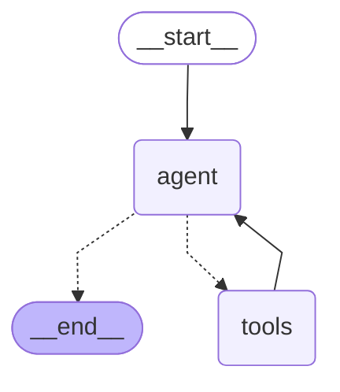

# Lab 4 LangGraph Visualization

This is the visualization of your `TravelBuddy` LangGraph. 



### 3 Methods to Visualize LangGraph

#### 1. Direct Mermaid in Obsidian (Recommended)
Since you are using Obsidian, simply paste the code above into any markdown (`.md`) file. Obsidian will automatically render it as a diagram.

#### 2. Save as Image (Python Script)
Add this utility to your `agent.py` or a new script to generate a PNG file. 
> [!NOTE]
> This requires `pygraphviz` or `pydantic-core` (depending on your environment).

```python
def save_graph_image(graph, filename="agent_graph.png"):
    try:
        # Requires extra dependencies installed
        graph.get_graph().draw_mermaid_png(output_file_path=filename)
        print(f"Graph saved to {filename}")
    except Exception as e:
        print(f"Error saving PNG: {e}")
        # Fallback to printing the mermaid string
        print("Mermaid string for copy-paste:")
        print(graph.get_graph().draw_mermaid())

save_graph_image(graph)
```

#### 3. Integrate into Chatbot API
If you want to see the graph in your frontend, add an endpoint:

```python
# In your FastAPI/Flask app
@app.get("/graph")
async def get_graph():
    return {"mermaid": graph.get_graph().draw_mermaid()}
```

Then in your React frontend, use `mermaid.js` to render it.
